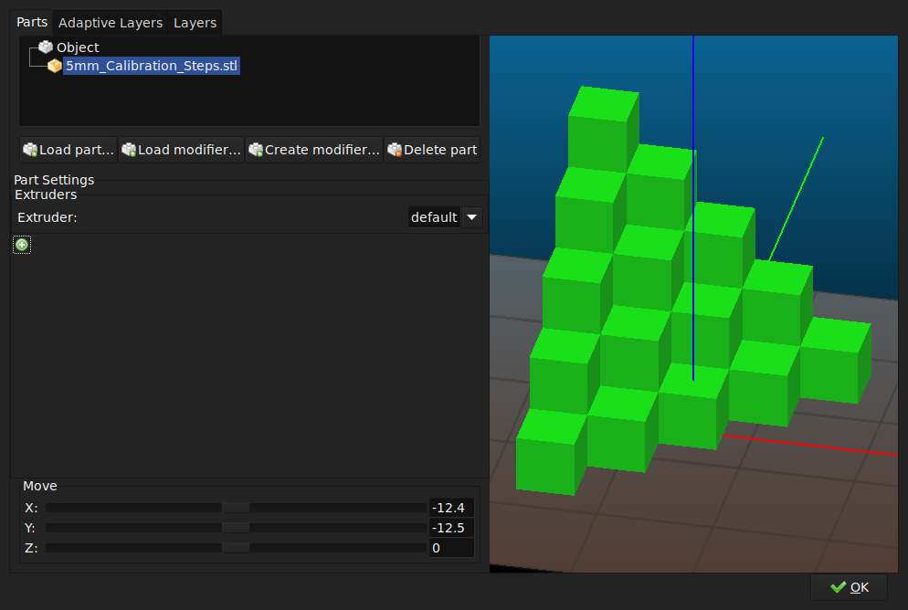

% Multiple Extruders

A printer with more than one extruder can be used in different ways.
If you have a *multi-part* model, that defines distinct regions, you can
assign each one of them to an extruder.
If you have a *single part* model, you can assign different roles to each
extruder: for example, you can infill using a larger nozzle or you can 
build support material with soluble filament.

Configuring Extruders
---------------------

In the `Printer Settings` tab there is an `Extruders` option, under
`Capabilities`, which allows the number of extruders to be defined.
Incrementing this value will dynamically add another extruder definition
to the left-hand pane.

 

Each extruder can be configured as usual, however there are additional
settings which must be set which are particular to multi-extruder
setups.

 

The `Extruder offset` is to be used should the firmware not handle the
displacement of each additional nozzle. Your firmware documentation
should tell you if this is the case. Each additional extruder is given
an offset in relation to the first one (which usually has 0,0 offset).
If the firmware does handle the displacements then all offsets can
remain at 0,0.

Because the secondary extruder will be dormant whilst the first is
working, and vice-versa, it is important that the material is
sufficiently retracted to stop oozing. As with the regular retraction
settings the `Length` options is measured from the raw filament entering
the extruder.

Configuring Tool Changes
------------------------

The `Custom G-code` section of the `Printer Settings` tab has an option
for inserting G-code between tool changes. As with all custom G-code
sections, placeholder variables can be used to reference Slic3r
settings. This includes the `[previous_extruder]` and `[next_extruder]`
variables.

Assigning Filaments
-------------------

When a printer profile with multiple
extruders has been selected the `Plater` tab allows the selection of a
different filament for each extruder.

Assigning Extruders for Single-material Objects
-----------------------------------------------

For single material prints, where the secondary extruder is to be tasked
with a particular extrusion, the `Multiple Extruders` section of the
`Print Settings` tab gives the ability to assign an extruder to each
extrusion type.

 

Printing Multi-material Objects
-------------------------------

If a multi-material AMF file already exists, because the CAD program can
export such a format, then this can be loaded into Slic3r in the usual
way. The mapping between object materials and extruders is sequential,
i.e. the first material is assigned to the first extruder, etc.

Generating multi-material AMF files
-----------------------------------

Slic3r has the feature to combine multiple STL files into a
multi-material AMF file.

-   Split the original design into the separate parts within the CAD
    program, and export each part as STL.

-   Within Slic3r, load one of the STLs into the plater.
-   Right-click on the part and select "Settings".
 
-   Select "Load Part" and select one of the STL files.
-   Select it in the UI and move it around.
-   Assign it an extruder.
-   Continue until all parts have been added and positioned. 
-   Click "OK" and right-click the combined part again and select "Export to AMF". 

Once generated the file can be loaded and printed as described above.
