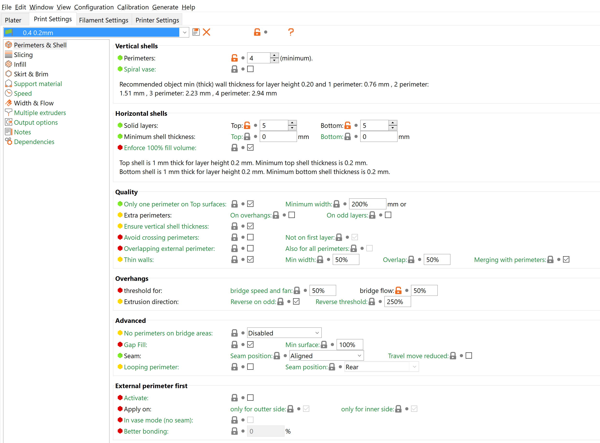
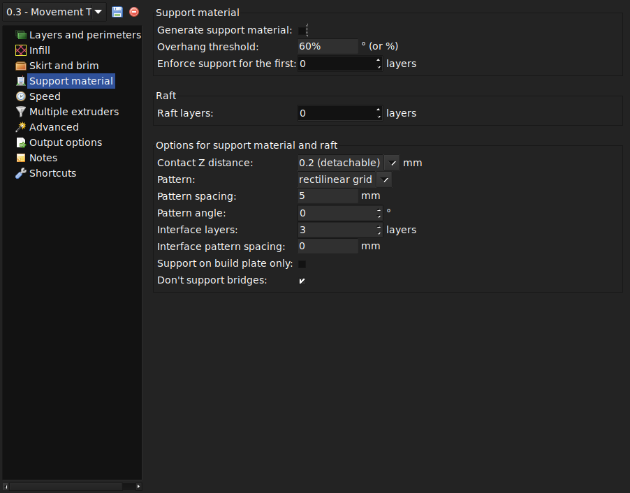
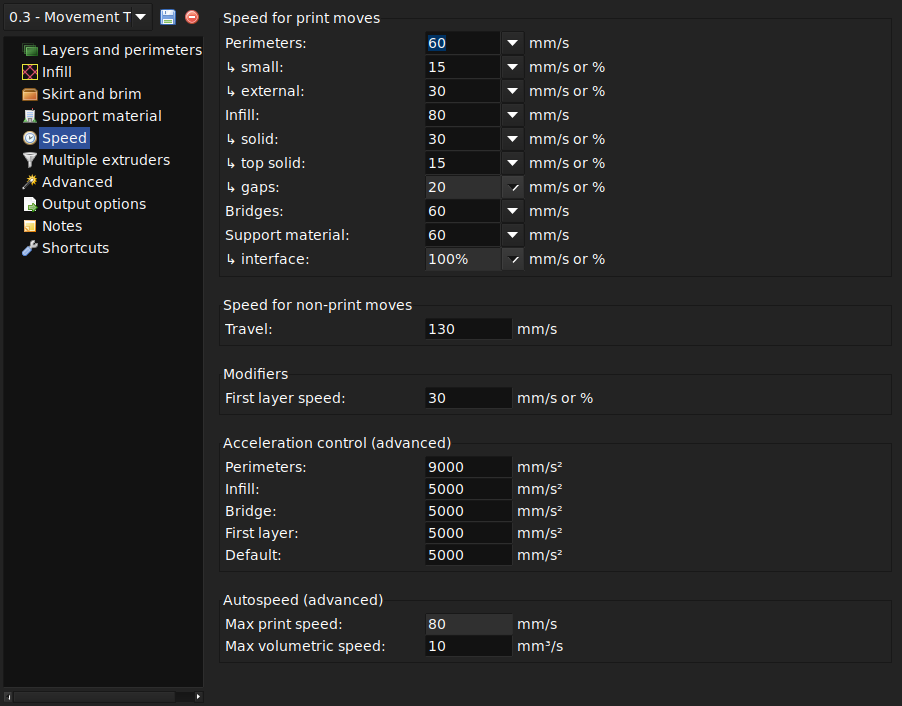

% Print Settings

This page will provide an overview of the available configuration settings in
Slic3r. Every configuration option has a tooltip and it is recommended to read
those tooltips. 

Print Settings
--------------

The `Print Settings` tab provides the opportunity to change settings
related to the actual print. Whereas the other tabs are changed rarely,
the settings on this tab will be modified regularly, possibly for each
model printed.

#### General.

`Layer height` is the thickness of each layer, and it is the step along
the vertical axis taken before extruding a new layer atop the previous
one. There are several factors that influence how high each layer should
be:

-   **Desired resolution** - Lower layer height should result in prints
    with less noticeable ribs or bands, as each layer is smaller.
    Aesthetics plays a role here, but also the type of model, for
    example, a mechanical part may not need such a high resolution
    finish, whereas a presentation piece may do so.

-   **Print speed** - Shorter layers will result in smoother prints but
    each print will take longer, simply because the extruder must trace
    the pattern more times. A later goal will be to strike a balance
    between layer height, the speed of the printer, and the quality of
    the resulting print.

`Perimeters` defines the minimum number of vertical shells (i.e. walls)
a print will have. Unless the model requires single width walls it is
generally recommended to have a minimum of two perimeters as this gives
some insurance that if a section of the perimeter is not printed
correctly then the second perimeter will help cover it.

The upper and lowermost layers that sandwich the model are filled with a
`Solid layers` pattern. For the bottom layers the important factor to
consider is how the surface will look should there be a mistake whilst
laying down the first layer, and for this reason it is recommended to
have at least two bottom layers.

A similar consideration is required for the top layers. Because the
intermediate layers are likely to be filled with a pattern set less than
100% then the covering layers will have to bridge this pattern and this
can require more than one pass to cover completely.

  

Another tip to consider: Setting the top solid layer to zero, and
setting the infill also to zero, will result in a hollow receptacle,
ideal for turning models into vases[^1] for example. Here manipulating
the settings within Slic3r can be used to generate different kinds of
prints, and not only be used to control surface accuracy.

 

#### Infill.

 `Fill density` is defined on a scale of between 0
and 1, where 1 is 100% and 0.4 would be 40%. For the majority of cases
it makes no sense to 100% fill the model with plastic, this would be a
waste of material and take a long time. Instead, most models can be
filled with less material which is then sandwiched between layers filled
at 100% (see `Solid layers` above).

A density value of 0.4 is enough to give almost all models good
mechanical strength. A value of 0.2 is usually the minimum required to
support flat ceilings.

Slic3r offers several fill patterns which will be discussed in more
depth in section  - Infill Choices.
Choosing a `Fill pattern` will depend on the kind of model, the desired
structural strength, print speed, and personal taste. The more exotic
fill methods are usually too slow and unnecessarily complex for most use
cases, and so most of the time the infill pattern is either
`rectilinear`, `line`, or `honeycomb`. Honeycomb gives the most strength
but is slower than both rectilinear or line.

#### Support material.

 Printing a model from the bottom up, as
with FDM, means that any significant overhangs will be printed in the
air, and most likely droop or not print correctly. Choosing support
material (`Generate support material`) will add additional structures
around the model which will build up to then support the overhanging
part. The `Pattern spacing` option determines how dense the support
material is printed.

 

Tip: It is sometimes worth considering altering the orientation of the
model in order to possibly reduce overhangs.

`Raft layers` will add additional layers underneath the model and stems
from the early days of 3D printing. It can help with prints without a
heated bed, or where the bed is not very flat, but it is usually not
required and is not recommended. The raft also requires post-processing
to remove it.

#### Speed.

 In simple mode there are only three speed settings
to consider:

-   `Perimeters` - The outline of the model may benefit from being
    printed slightly slower so that the outside skin of the print has
    fewer blemishes.

-   `Infill` - As the infill is hidden this can be extruded a little
    faster. Take care though not to go too fast as higher speeds results
    in thinner extrusions, and this may affect how the extrusions bond.

-   `Travel` - The jump between the end of one extrusion and the next
    should usually be performed as quickly as the printer will allow in
    order to minimise any mess caused by material oozing from the
    nozzle.

#### Brim.

 `Brim width` is used to add more perimeters to the
first layer, as a base flange, in order to provide more surface area for
the print to stick to the bed with in order to reduce warping (see
§). The brim is then cut away once the
print is finished and removed from the bed.

 

#### Sequential Printing.

 This feature allows to compose a plate of
objects but have the printer complete each one individually before going
back to Z = 0 and starting with the next one. See the section about
Sequential Printing in the Advanced Topics chapter.

Filament Settings
-----------------

The `Filament Settings` will normally be used infrequently, for example
on receipt of a new roll of filament.

 

#### Filament.

 The `Diameter` setting will already have been filled from
the value given during the wizard (see p.), but can be updated here.

The `Extrusion multiplier` setting allows the fine tuning of the
extrusion flow rate, and is is given as a factor, e.g. 1 means 100%, 1.5
would mean 150%. Whilst the value should ideally be set in the firmware
it can be useful to test slight changes to the rate by altering this
value. It varies the amount of plastic proportionally and should be
changed in very small steps (e.g. +/- 0.05) as the effects are very
visible.

#### Temperature.

 These values are also filled from the wizard, but here
the opportunity exists to set the temperature for the first layer (see
p.).

Printer Settings
----------------

The `Printer Settings` will be updated the least, unless Slic3r is going
to be used for many printers, for example, in a 3D printer farm.

 

#### Size and coordinates.

 The `Bed size` setting is taken from the
wizard (see p.) and is only used for previewing the model in the plater.

The `Print center` is the point around which the print will be centered.
A `Bed size` of 200mmx200mm and a `Print center` of 100mmx100mm would
sit the print in the middle. Should it be desired to print away from the
center, because of a scratch in the glass perhaps, then this option
should be used.

`Z offset` can be used to compensate for an incorrectly calibrated Z
end-stop. If the nozzle stops slightly too far from the bed, then adding
a negative value will offset all layers by that amount. The correct
solution however is to fix the end-stop itself.

The optimal Z endstop position is where the nozzle tip barely touches
the surface of the bed when homed. A sheet of paper makes a good gauge
for this very small distance. It is not recommended to use this setting
to try and improve layer adhesion, by "squashing" the bottom layer into
the bed, instead look at the suggestions in section
.

#### Firmware.

 As selected in the wizard (see p.), `G-code flavour`
defines the dialect of G-code generated.

#### Extruder.

 `Nozzle diameter` was defined in the wizard (see p.).

#### Retraction.

 Unless the material being extruded has a very high
viscosity it may ooze between extrusions due to gravity. This can be
remedied by actively retracting the filament between extrusions. Setting
the `Length` parameter to a positive value will cause the filament to be
reversed by that many millimeters before travel. The retraction will
then be compensated for by the same amount after the travel move, before
starting the new extrusion path.

A value of between 1 and 2mm is usually recommended. Bowden extruders
may need up to 4 or 5mm due to the hysteresis introduced by the tube.
Setting the `Lift Z` parameter to a positive value will raise the entire
extruder on the Z axis by that many millimeters during each travel. This
can be useful to ensure the nozzle will not catch on any already laid
filament, however it is usually not necessary and will slow the print
speed. A value of 0.1mm is usually sufficient.

#### Start, End and Layer Chance G-codes.

 Custom G-code commands can be run before a print
starts and after a print finishes.

Placeholders can be inserted in the G-code commands[^2]. For example
[next\_extruder] would return the index of the next extruder.

The RepRap wiki is a good resource to learn about the variety of G-codes
available: `http://reprap.org/wiki/G-code`.

Note: Be sure to check that a given G-code is valid for your firmware.

The codes specified in `Start G-code` are inserted at the beginning of
the output file, directly after the temperature control commands for
extruder and bed. Note that if temperature control commands are
specified (M104 and M190) then these will replace the temperature
G-codes introduced by the `Filament` settings.

Some common G-codes to use before the print starts are:

-   **G28** - Homes all the axes.

Some common G-codes to use after the print ends are:

-   **M104 S0** - Sets the extruder temperature to zero.

-   **M140 S0** - Sets the heated bed temperature to zero.

-   **G28 X0** - Home the X axis.

-   **M84** - Disables the motors.

[^1]: http://slic3r.org/blog/tip-printing-vases

[^2]: https://github.com/alexrj/Slic3r/wiki/FAQ\#what-placeholders-can-i-use-in-custom-g-code
