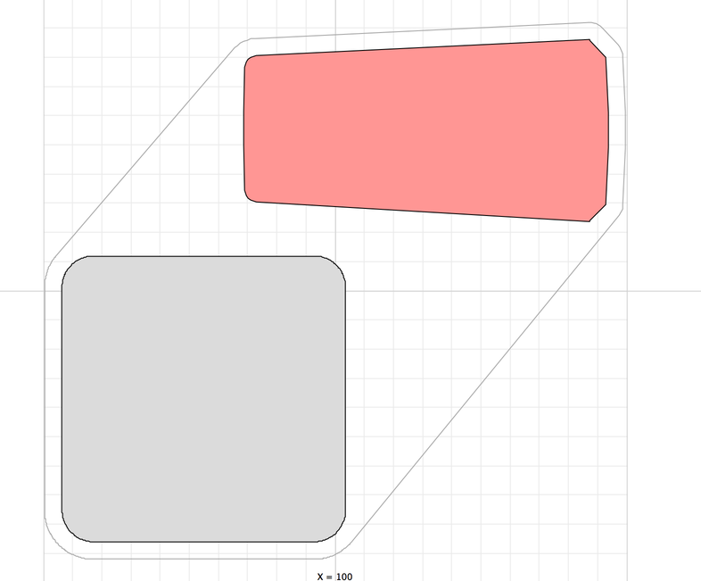
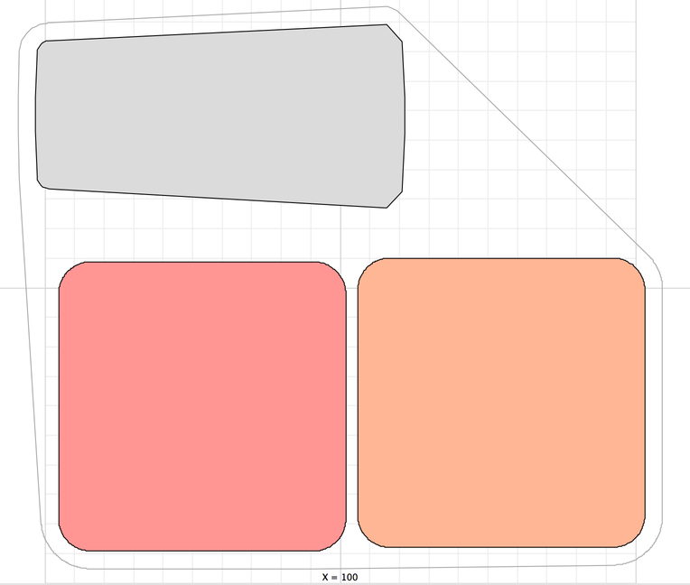

% Working with Models

Yet another step lies between now and the first print - a model has to
found and then sliced.

Model Formats
-------------

Slic3r accepts the following file types.

-   STereoLithography (STL) files can come from a wide variety of
    sources and are now a de facto standard in 3D printing. The files
    simply describe the surface geometry of a 3D object without any
    additional information (such as colour or material), and it is this
    simplicity that has probably made the format ubiquitous.

-   Wavefront OBJ files are an open format originally used in an
    animation application from Wavefront Technologies, but has since
    been adopted by the wider 3D modelling community. It is similar to
    the STL format.

-   Additive Manufacturing File Format (AMF) was developed in response
    to the limited nature of the STL format. In addition to describing
    the geometry of the 3D model it can also describe colours and
    materials, as well as more complex attributes, such as gradient
    mixes and multiple object arrangements (constellations). Whilst the
    format is deemed a standard it has yet to be widely adopted in the
    3D maker community.

Finding Models
--------------

The 3D model files may come from an online repository, such as
Thingiverse[^1] or GrabCAD[^2], or be created from a CAD program, such
as FreeCAD[^3], Sketchup[^4], or OpenSCAD[^5], or an online CAD tool
such as Shapesmith[^6].

You may wish to view the files before slicing and there are many free
applications available, one of which is Meshlab[^7] - a comprehensive
tool for viewing and working with 3D files.

  

Working with Plater
-------------------

 Slic3r has a tool, called Plater, which
allows one or more models to be loaded and arranged before being sliced.

  

Once you have acquired a model, drag it onto the Plater window (or use
the Add button below the file list) to load it into Slic3r. In the
figure below, the traditional RepRap Minimug[^8] is loaded, and is
viewed from above. The ring around the model is a skirt - a single
perimeter, several millimeters away from the model, which is extruded
first. This is useful in making sure the plastic is flowing smoothly
from the nozzle when the model is starting to be printed.

 

 

The model can be repositioned by dragging the representation of it on
the left of the screen around the bed. Note that the dimensions of the
bed should match your printer, as given during the initial configuration
above.

You can move a selected instance using keyboard.
* On MacOS and Linux: You can use either <kbd>↑</kbd>, <kbd>↓</kbd>, <kbd>←</kbd>, <kbd>→</kbd> or  <kbd>W</kbd>, <kbd>A</kbd>, <kbd>S</kbd>, <kbd>D</kbd>.
* On Windows: You can use **only** <kbd>W</kbd>, <kbd>A</kbd>, <kbd>S</kbd>, <kbd>D</kbd>.

You are also able to configure the displacement or nudge value. To change the nudge value (it's 1mm by default):
* Press <kbd>Ctrl or ⌘ Command</kbd> + <kbd>,</kbd>.

In the "2D plater nudge value" box you can assign integer values as well as decimal values (the minimum value is 0.1 mm).

You can use the select prev. or select next object shortcuts <kbd>Ctrl or ⌘ Command</kbd> + <kbd>→ or ←</kbd>. If the object selected has more than 1 instance, the first instance will be the selected one by default and it will be colored red.

On the right-hand side is the list of currently loaded files. The
buttons along the top of the file list allow you to arrange the models.

-   **More/Less** - Adjust how many copies should be printed.

-   **45°/Rotate** - Rotate the selected model around the Z axis, either
    in 45° increments clockwise or counter-clockwise, or by a given
    amount.

-   **Scale** - Increase or decrease the size of the printed model.

-   **Split** - Divides a model which consists of more than one part
    into it’s constituent parts, allowing each one to be arranged
    individually.

The buttons along the bottom of the file list allow you to add, remove,
auto-arrange, or export the models.

-   **Add** - Opens a file dialog to add a model to the plater, as an
    alternative to dropping a file directly.

-   **Delete/Delete All** - Remove one or all models from the plater.

-   **Autoarrange** - Attempt to arrange the models to give the optimal
    layout.

-   **Export G-code** - Starts slicing the model and produces a G-Code
    file.

-   **Export STL** - Save the current set of models as a single STL
    file.

Cleaning STLs
-------------

 If the 3D mesh described in the model contains
holes, or edges are misaligned (known as being non-manifold), then
Slic3r may have problems working on it. Slic3r will attempt to fix any
problems it can, but some problems are out of its reach. If the
application complains that a model cannot be sliced correctly then there
are several options available: see the chapter about Repairing Models.

[^1]: <http://www.thingiverse.com>

[^2]: <http://grabcad.com>

[^3]: <http://sourceforge.net/projects/free-cad>

[^4]: <http://www.sketchup.com>

[^5]: <http://www.openscad.org>

[^6]: <http://shapesmith.net>

[^7]: <http://www.meshlab.org>

[^8]: <http://www.thingiverse.com/thing:18357>
